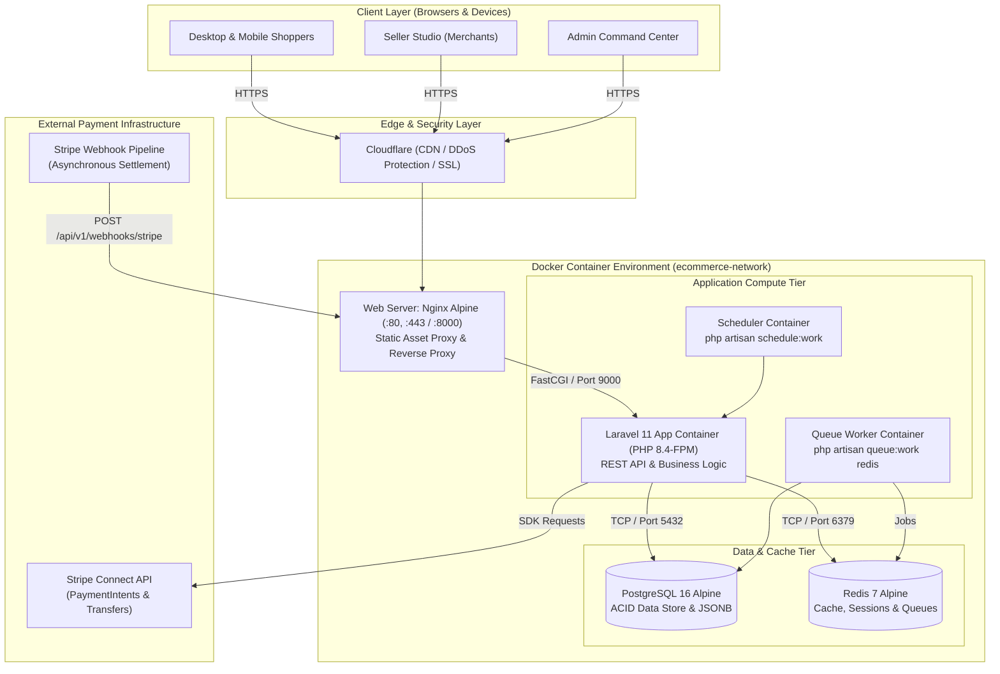
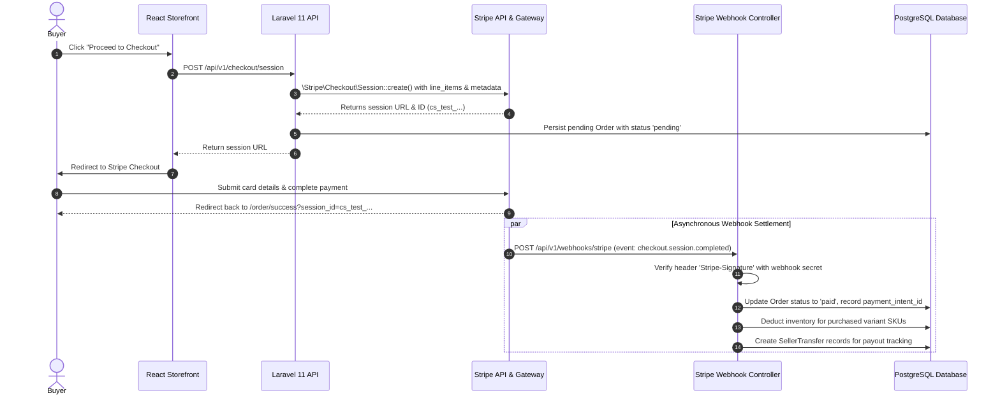

# FOLD. — Enterprise Multi-Vendor Apparel Marketplace

[](https://php.net)
[](https://laravel.com)
[](https://react.dev)
[](https://www.typescriptlang.org)
[](https://tailwindcss.com)
[](https://www.postgresql.org)
[](https://redis.io)
[](https://www.docker.com)
[](https://stripe.com)
[](https://phpunit.de)
[](https://laravel.com/docs/pint)

---

## 1. Executive Summary

**FOLD.** is a high-performance, full-stack multi-vendor apparel e-commerce marketplace platform. Designed around the modern direct-to-consumer (DTC) and boutique merchant ecosystem, FOLD. allows independent apparel brands and ateliers to manage listings, variants, stock, and payouts, while delivering an editorial, mobile-first shopping experience to buyers.

The system is architected as a decoupled, headless application featuring a **Laravel 11 RESTful API** backend and a reactive **React 18 / TypeScript / Tailwind CSS v4** single-page frontend. It integrates enterprise-grade financial settlement through **Stripe Connect**, resilient background queuing via **Redis**, relational integrity through **PostgreSQL 16**, multi-stage **Docker containerization**, and an autonomous **Obsidian Memory Brain** that captures project decisions and architecture state directly within the repository.

---

## 2. System Architecture & Topology



### Container Topology & Service Separation

| Service | Container Name | Base Image | Core Responsibility |
|---|---|---|---|
| **App** | `ecommerce-prod-app` | `php:8.3/8.4-fpm-alpine` | Core Laravel API runtime, business logic, ORM |
| **Worker** | `ecommerce-prod-worker` | `php:8.3/8.4-fpm-alpine` | Dedicated background queue consumer (`queue:work redis`) |
| **Scheduler** | `ecommerce-prod-scheduler` | `php:8.3/8.4-fpm-alpine` | Replaces host cron, dispatches scheduled tasks (`schedule:work`) |
| **Webserver**| `ecommerce-prod-webserver` | `nginx:alpine` | Reverse proxy, SSL termination, static asset delivery |
| **Database** | `ecommerce-prod-db` | `postgres:16-alpine` | Persistent relational store with named volumes |
| **Cache** | `ecommerce-prod-redis` | `redis:7-alpine` | In-memory caching, user sessions, queue broker (`appendonly yes`) |

---

## 3. Core Platform Surfaces

FOLD. enforces strict **Role-Based Interface Isolation** (`ADR-009`). The public storefront, merchant backoffice, and platform oversight portals operate with distinct navigational contexts and authorization gates:

```
                    ┌───────────────────────────────────────────────┐
                    │            AUTHENTICATION GATEWAY             │
                    │         (Laravel Sanctum Bearer Auth)         │
                    └───────┬───────────────────┬───────────────────┘
                            │                   │
               Role: 'buyer'│       Role: 'seller'│      Role: 'admin'
                            ▼                   ▼                   ▼
                     [ STOREFRONT ]      [ SELLER STUDIO ]   [ ADMIN CENTER ]
                     Path: /             Path: /seller       Path: /admin
```

### 1. Buyer Storefront (`/`)
- **"The Rail & The Rack" Design System:** High-end boutique aesthetic rejecting generic e-commerce templates. Clean typography, subtle micro-interactions (Framer Motion), and responsive touch sliders (Swiper.js).
- **Above-the-Fold Product Discovery (`ADR-010`):** Products, pricing, scarcity indicators, and category rails appear immediately upon landing—free of oversized corporate hero banners.
- **Dynamic Variant Matrix:** Real-time selection of sizes, colors, and stock counters with instant pricing adjustments.
- **Interactive Cart & Coupons:** Responsive flyout cart drawer with live discount code evaluation and subtotal recalculation.
- **Stripe Checkout:** Seamless redirection to Stripe's hosted checkout sessions with automated fallback order creation.
- **Customer Account & Wishlist:** Real-time wishlist toggling, customer profile updates, and historical order status tracking.

### 2. Seller Studio (`/seller`)
- **Merchant Dashboard:** Real-time gross sales, volume analytics, average order value (AOV), and pending fulfillment counts.
- **Product & Inventory Management:** Multi-variant SKU management (sizes, colors, inventory thresholds), price setting, category assignment, and image upload with real-time preview.
- **Promotions & Coupons:** Merchant-issued discount codes with percentage or fixed reductions, expiration dates, and minimum order rules.
- **Order Fulfillment Pipeline:** Live status tracking from `pending` to `processing`, `shipped` (with tracking numbers), and `delivered`.
- **Stripe Connect Payout Portal:** Onboarding status check and direct access to Stripe Express payout dashboards.

### 3. Admin Command Center (`/admin`)
- **Marketplace Governance:** Real-time platform Gross Merchandise Value (GMV), active seller counts, customer accounts, and fee analytics.
- **Merchant Onboarding & Moderation:** Verification pipeline to approve, audit, or suspend apparel seller storefronts.
- **Catalog Tree Management:** Centralized category hierarchy creation, editing, and slug management.
- **Financial Refunds & Restocking:** Admin-mediated order cancellations with automated Stripe refund triggering and PostgreSQL inventory replenishment.
- **User Moderation:** System-wide account suspension and compliance control.

---

## 4. Technology Stack Matrix

| Layer | Technology | Version | Purpose & Rationale |
|---|---|---|---|
| **Backend Framework** | Laravel | `^11.0` / `^13.17` | Clean MVC architecture, Eloquent ORM, robust middleware, first-party queue/cache ecosystem. |
| **Backend Language** | PHP | `8.3` / `8.4` | Modern typed PHP with constructor property promotion, enums, and JIT compilation. |
| **API Authentication** | Laravel Sanctum | `^4.0` | Lightweight token-based authentication for single-page and multi-surface applications. |
| **Frontend Framework** | React | `^18.3` | Component-driven UI with declarative state and concurrent rendering. |
| **Frontend Language** | TypeScript | `^5.9` | End-to-end interface typing matching backend API resources. |
| **Build Tooling** | Vite | `^8.0` | Sub-second Hot Module Replacement (HMR) and optimized rollup production bundles. |
| **CSS Framework** | Tailwind CSS | `^4.0` | Utility-first styling with zero runtime overhead and custom editorial design tokens. |
| **UI Motion & Sliders** | Framer Motion & Swiper | `^13.4` / `^14.2` | Orchestrated spring animations, slide-overs, and mobile swipe carousels (`ADR-007`). |
| **Primary Database** | PostgreSQL | `16 Alpine` | Strict ACID compliance, relational foreign keys, and JSONB event payload auditing (`ADR-002`). |
| **In-Memory Store** | Redis | `7 Alpine` | High-speed cache store, distributed session driver, and persistent queue backend (`ADR-003`). |
| **Payment Gateway** | Stripe Connect | `^21.3` | Multi-seller payment processing, automated platform fee deduction, and webhooks (`ADR-006`). |
| **Web Server** | Nginx | `Stable Alpine` | Reverse proxy handling HTTP/HTTPS, compression, and routing requests to PHP-FPM. |
| **Code Formatting** | Laravel Pint | `^1.27` | PSR-12 and Laravel opinionated coding standards enforcement. |
| **Static Analysis** | Larastan (PHPStan) | `^3.12` (Level 5) | Compile-time bug detection and strict type inference for Laravel Eloquent models. |
| **Testing Framework** | PHPUnit | `^12.5` | Automated integration and feature test suite covering 78 test cases across all API endpoints. |

---

## 5. Autonomous Obsidian Memory Brain (`/obsidian-memory`)

This repository integrates an autonomous **Obsidian Memory Brain** protocol (`.agents/skills/obsidian-memory/SKILL.md`), transforming the project's markdown vault into a persistent cognitive knowledge graph.

### The Hierarchy of Truth

```
┌─────────────────────────────────────────────────────────┐
│              CURRENT USER INSTRUCTION                   │
└───────────────────────────┬─────────────────────────────┘
                            ▼
┌─────────────────────────────────────────────────────────┐
│       ACTUAL SOURCE CODE & MIGRATIONS (Authoritative)   │
└───────────────────────────┬─────────────────────────────┘
                            ▼
┌─────────────────────────────────────────────────────────┐
│                 PROJECT CONFIGURATION                   │
└───────────────────────────┬─────────────────────────────┘
                            ▼
┌─────────────────────────────────────────────────────────┐
│        OBSIDIAN MEMORY BRAIN (Vault/ECOMMERCE VAULT/)   │
└───────────────────────────┬─────────────────────────────┘
                            ▼
┌─────────────────────────────────────────────────────────┐
│                 PROJECT DOCUMENTATION                   │
└─────────────────────────────────────────────────────────┘
```

The source code in the repository is **always authoritative**. Obsidian notes record architectural rationales, verified discoveries, and user preferences, but never supersede working application code.

### Knowledge Vault Structure (`Vault/ECOMMERCE VAULT/`)

```
Vault/ECOMMERCE VAULT/
├── 00 - Core Memory/         # System status, active features, and central index
├── 01 - Project Memory/      # Domain models, marketplace scope, and merchant personas
├── 02 - Architecture/        # System topology, data flow, and runtime mechanics
├── 03 - Decisions/           # Architecture Decision Records (ADR-001 to ADR-010)
├── 04 - Requirements/        # Functional and non-functional specifications
├── 05 - User Preferences/    # UI/UX principles, design rules, and coding standards
├── 06 - Technical Knowledge/ # Specialized Stripe, PostgreSQL, and Redis manuals
├── 07 - Problems & Solutions/# Root cause analyses, post-mortems, and verified bug fixes
├── 08 - Completed Work/      # Verified milestones, changelogs, and completed features
├── 09 - Current State/       # In-flight tasks and active sprint objectives
├── 10 - Temporary/           # Ephemeral debugging scratchpads and investigations
└── 99 - Archive/             # Deprecated documentation preserved for historical context
```

### Git and Docker Isolation Strategy

To maintain strict boundaries between development knowledge, version control, and production builds, the repository enforces dedicated ignore policies:

#### 1. Version Control Discipline (`.gitignore`)
The Obsidian markdown knowledge base (`Vault/ECOMMERCE VAULT/*.md`) is fully tracked in Git so architectural decisions are shared with team members and AI coding assistants. However, volatile machine-specific desktop files generated by Obsidian are explicitly ignored:
```gitignore
# Obsidian Memory Brain (Volatile UI state, caches, and trash)
**/.obsidian/workspace.json
**/.obsidian/workspace-mobile.json
**/.obsidian/cache/
**/.obsidian/indexeddb/
**/.obsidian/hotkeys.json
**/.obsidian/backlink-cache.json
**/.trash/
**/*.sync-conflict-*
```

#### 2. Production Container Isolation (`.dockerignore`)
Production Docker images must be lean, secure, and contain only runtime artifacts. The Obsidian vault and AI agent configurations are strictly excluded from the Docker build context:
```dockerignore
# Autonomous Obsidian Memory Brain & Agent Customizations
/Vault/
**/Vault/
**/.obsidian/
/.agents/
/references/
/scratch/
```
**Benefits of this isolation:**
- **Zero Image Bloat:** Prevents hundreds of documentation and image assets from inflating container sizes.
- **Security & IP Protection:** Ensures internal architecture notes, post-mortems, and developer scratchpads are never published inside production containers.
- **Cache Optimization:** Modifying documentation in `Vault/` does not invalidate Docker build caches, speeding up CI/CD pipelines.

---

## 6. REST API Specification

All API endpoints are versioned under the `/api/v1/` prefix and utilize standard HTTP status codes and JSON payloads.

```
POST   /api/v1/auth/register                   Register new buyer or seller account
POST   /api/v1/auth/login                      Authenticate and issue Sanctum token
POST   /api/v1/auth/logout                     Revoke current Sanctum token
GET    /api/v1/auth/user                       Fetch authenticated user identity & roles

GET    /api/v1/categories                      List active apparel categories
GET    /api/v1/categories/{category}           Get category details and nested products
GET    /api/v1/products                        Query catalog (filters: category, price, size, sort)
GET    /api/v1/products/suggestions            Instant search suggestions
GET    /api/v1/products/{product}              Detailed product record with variants & reviews

POST   /api/v1/products/{product}/reviews      Submit product review (verified purchase check)
GET    /api/v1/wishlist                        Get user's saved wishlist items
POST   /api/v1/wishlist/{product}/toggle       Add or remove item from wishlist
GET    /api/v1/addresses                       List customer shipping addresses
POST   /api/v1/addresses                       Save new shipping address
DELETE /api/v1/addresses/{address}             Delete saved shipping address

GET    /api/v1/cart                            Inspect active cart, items, and discounts
POST   /api/v1/cart/items                      Add SKU variant to cart
PUT    /api/v1/cart/items/{productId}          Update item quantity in cart
DELETE /api/v1/cart/items/{productId}          Remove line item from cart
DELETE /api/v1/cart                            Clear entire cart
POST   /api/v1/cart/coupon                     Validate and apply coupon code
DELETE /api/v1/cart/coupon                     Remove applied coupon code

POST   /api/v1/checkout/session                Generate Stripe Checkout session
GET    /api/v1/checkout/orders/{orderNumber}   Polling endpoint for order fulfillment status
GET    /api/v1/orders                          List authenticated customer order history
GET    /api/v1/orders/{order}                  Get single order breakdown with line items

GET    /api/v1/seller/dashboard                Merchant metrics (sales, orders, stock alerts)
GET    /api/v1/seller/products                 List merchant-owned catalog items
POST   /api/v1/seller/products                 Create new product with variants and media
PUT    /api/v1/seller/products/{product}       Update product pricing, details, and SKUs
DELETE /api/v1/seller/products/{product}       Soft-delete or unpublish product
POST   /api/v1/seller/media/upload             Upload product photography
GET    /api/v1/seller/coupons                  List seller-created promo codes
POST   /api/v1/seller/coupons                  Generate new coupon code
GET    /api/v1/seller/orders                   Orders containing seller's items
PUT    /api/v1/seller/orders/{item}/fulfillment Update fulfillment state & tracking info
POST   /api/v1/seller/payout-setup             Initiate Stripe Connect onboarding link

GET    /api/v1/admin/sellers                   Audit seller applications and statuses
PUT    /api/v1/admin/sellers/{seller}/status   Approve, suspend, or reject seller store
GET    /api/v1/admin/analytics                 Global platform GMV and revenue metrics
GET    /api/v1/admin/orders                    Marketplace-wide order audit log
POST   /api/v1/admin/orders/{order}/refund     Process full or partial refund + restock
POST   /api/v1/admin/categories                Create new taxonomy category
PUT    /api/v1/admin/categories/{category}     Update taxonomy category
DELETE /api/v1/admin/categories/{category}     Delete taxonomy category
PUT    /api/v1/admin/users/{user}/ban          Toggle global user ban

POST   /api/v1/webhooks/stripe                 Stripe webhook intake (signature verified)
```

---

## 7. Stripe Connect & Payment Processing

### Multi-Vendor Payment Architecture (`ADR-006`)
FOLD. utilizes **Stripe Connect** to facilitate direct customer checkout while automatically splitting payouts among independent apparel merchants:
1. **Direct Checkout:** Buyers complete a single unified payment session on Stripe Checkout for items potentially sourced from multiple sellers.
2. **Platform Commission Deduction:** The platform retains a configurable marketplace application fee (e.g., 10%) before scheduling payout transfers to vendor connected accounts (`acct_xxxx`).
3. **Idempotency & Reconciliations:** All checkout sessions pass unique idempotency keys to prevent duplicate charges upon network retries.



### Webhook Verification & Local Testing
To test Stripe webhooks locally during development, utilize the official **Stripe CLI**:

```bash
# 1. Authenticate with Stripe
stripe login

# 2. Forward webhook events to local Laravel API
stripe listen --forward-to localhost:8000/api/v1/webhooks/stripe

# 3. Trigger test events from another terminal
stripe trigger checkout.session.completed
stripe trigger payment_intent.succeeded
```

### Out-of-Sync Recovery Command
If webhook delivery fails due to network downtime, run the automated synchronization artisan command:

```bash
php artisan stripe:sync-orders
```

---

## 8. Getting Started & Local Development

### Prerequisites
- **PHP:** `^8.3` or `^8.4` with extensions (`pdo_sqlite`, `pdo_pgsql`, `mbstring`, `zip`, `bcmath`, `redis`)
- **Composer:** `^2.8`
- **Node.js & npm:** Node `^20.x` or `^22.x`, npm `^10.x`
- **Docker & Docker Compose:** Required for containerized workflow

---

### Option A: Native Local Setup (Quickstart)

```bash
# 1. Clone repository
git clone https://github.com/arvnddl18/ecommerce-backend.git
cd ecommerce-backend

# 2. Install PHP and JavaScript dependencies
composer install
npm install

# 3. Prepare environment file
cp .env.example .env
php artisan key:generate

# 4. Run database migrations & seed test accounts
touch database/database.sqlite
php artisan migrate --seed

# 5. Start development servers concurrently
npm run dev
# In a separate terminal:
php artisan serve --port=8000
```
- Storefront UI: `http://localhost:8000/`
- Vite HMR: `http://localhost:5173/`
- REST API Root: `http://localhost:8000/api/v1/`

---

### Option B: Docker Containerized Setup (Production-Parity)

```bash
# 1. Configure environment for Docker
cp .env.docker .env

# 2. Build and launch all microservices in background
docker compose up -d --build

# 3. Execute migrations and seed database inside container
docker compose exec app php artisan migrate --seed

# 4. View container logs
docker compose logs -f app webserver
```
- App Container: `http://localhost:8000`
- PostgreSQL Port: `localhost:5432`
- Redis Port: `localhost:6379`

---

## 9. Seeded Test Credentials

The database seeder automatically initializes testing accounts across all three platform roles:

| Role | Email Address | Password | Permissions & Store Profile |
|---|---|---|---|
| **Platform Admin** | `admin@apexmarketplace.com` | `password` | Super Admin: Marketplace governance, vendor approvals, refunds |
| **Seller 1 (Streetwear)** | `apex@marketplace.test` | `password123` | Store: *Apex Threads Lab* (Approved merchant, multi-variant listings) |
| **Seller 2 (Techwear)** | `noir@marketplace.test` | `password123` | Store: *Noir Technical Studio* (Approved merchant, technical outerwear) |
| **Buyer (Shopper)** | `test@example.com` | `password` | Standard Buyer: Browsing, purchasing, saved addresses, wishlist |

---

## 10. Quality Assurance & Testing Suite

FOLD. adheres to rigorous testing standards. All PRs must maintain passing status on tests, code style formatting, and static analysis.

### 1. Automated PHPUnit Feature Tests
Comprehensive test coverage across authentication, role-based isolation, cart variant validation, Stripe webhooks, seller operations, and admin moderation:

```bash
# Run entire test suite
php artisan test --compact

# Run specific feature test
php artisan test tests/Feature/CheckoutTest.php
php artisan test tests/Feature/StripeWebhookTest.php
```

**Test Suite Coverage Summary:**
- `78 tests passing`
- `308 assertions verified`
- `0 failures, 0 errors`

### 2. Static Analysis with Larastan (PHPStan)
Larastan checks for type safety, missing model relations, and unsafe variable handling:

```bash
vendor/bin/phpstan analyse --memory-limit=512M
```

### 3. Code Style Enforcement with Laravel Pint
Enforces PSR-12 and clean code formatting across all PHP files:

```bash
vendor/bin/pint --format agent
```

---

## 11. Production Deployment & Docker Architecture

### Multi-Stage Dockerfile Strategy (`Dockerfile.prod`)
Production container builds use a **three-stage multi-stage Docker build** (`ADR-004`):
1. **Stage 1 (`frontend`):** Uses `node:20-alpine` to compile TypeScript and Vite assets into `/public/build/`. Discards all Node dev dependencies and binaries.
2. **Stage 2 (`vendor`):** Uses `composer:2.8` to resolve production-only dependencies with `--no-dev --optimize-autoloader`.
3. **Stage 3 (`production`):** Uses `php:8.3-fpm-alpine`, combines the compiled assets from Stage 1 and PHP vendor packages from Stage 2, installs optimized PHP extensions, and enables OPcache.

### OPcache Production Performance
Production PHP instances run with production-grade OPcache settings (`docker/php/opcache.ini`):
- `opcache.enable=1`
- `opcache.memory_consumption=128`
- `opcache.interned_strings_buffer=16`
- `opcache.max_accelerated_files=10000`
- `opcache.validate_timestamps=0` (timestamps disabled for maximum throughput in immutable containers)

### Launching in Production
```bash
# Deploy with production configuration
docker compose -f docker-compose.prod.yml up -d --build
```

---

## 12. Architecture Decision Records (ADRs)

Key architectural decisions are formally documented in `Vault/ECOMMERCE VAULT/03 - Decisions/`:

| ADR ID | Decision Title | Status | Rationale |
|---|---|---|---|
| **ADR-001** | [Headless REST API Architecture](file:///c:/arvincodework/ecommerce-backend/Vault/ECOMMERCE%20VAULT/03%20-%20Decisions/ADR-001_Laravel_11_Headless_REST_API.md) | `ACCEPTED` | Complete decoupling between backend domain models and reactive client storefronts. |
| **ADR-002** | [PostgreSQL 16 over MySQL](file:///c:/arvincodework/ecommerce-backend/Vault/ECOMMERCE%20VAULT/03%20-%20Decisions/ADR-002_PostgreSQL_16_over_MySQL.md) | `ACCEPTED` | Strict ACID transactions, native JSONB event columns, and production database parity. |
| **ADR-003** | [Redis for Cache, Sessions, & Queues](file:///c:/arvincodework/ecommerce-backend/Vault/ECOMMERCE%20VAULT/03%20-%20Decisions/ADR-003_Redis_for_Caching_Sessions_and_Queues.md) | `ACCEPTED` | Unified sub-millisecond memory caching and scalable asynchronous background queues. |
| **ADR-004** | [Multi-Stage Production Docker Builds](file:///c:/arvincodework/ecommerce-backend/Vault/ECOMMERCE%20VAULT/03%20-%20Decisions/ADR-004_Multi_Stage_Docker_Builds_for_Production.md) | `ACCEPTED` | Minimal attack surface and compact Alpine images omitting Node and Composer build tools. |
| **ADR-005** | [Cloudflare CDN & Edge Security](file:///c:/arvincodework/ecommerce-backend/Vault/ECOMMERCE%20VAULT/03%20-%20Decisions/ADR-005_Oracle_Cloud_Always_Free_Hosting.md) | `ACCEPTED` | Global SSL termination, edge caching of static Vite assets, and automated DDoS mitigation. |
| **ADR-006** | [Stripe Connect for Multi-Seller Payouts](file:///c:/arvincodework/ecommerce-backend/Vault/ECOMMERCE%20VAULT/03%20-%20Decisions/ADR-006_Stripe_Connect_for_Multi_Seller_Payouts.md) | `ACCEPTED` | Automated platform commission collection and compliant seller financial distribution. |
| **ADR-007** | [Framer Motion & Swiper.js Motion Standard](file:///c:/arvincodework/ecommerce-backend/Vault/ECOMMERCE%20VAULT/03%20-%20Decisions/ADR-007_Framer_Motion_and_Swiper_for_Frontend_Experience.md) | `ACCEPTED` | Smooth spring physics for micro-interactions and touch-optimized mobile carousels. |
| **ADR-008** | [The Rail & The Rack Storefront Design](file:///c:/arvincodework/ecommerce-backend/Vault/ECOMMERCE%20VAULT/03%20-%20Decisions/ADR-008_The_Rail_and_The_Rack_Storefront_Design_System.md) | `ACCEPTED` | Editorial luxury apparel visual identity rejecting cliché SaaS templates. |
| **ADR-009** | [Role-Based Interface Isolation](file:///c:/arvincodework/ecommerce-backend/Vault/ECOMMERCE%20VAULT/03%20-%20Decisions/ADR-009_Role_Based_Interface_Isolation.md) | `ACCEPTED` | Zero interface commingling between Buyer Storefront, Seller Studio, and Admin Center. |
| **ADR-010** | [Above-the-Fold Product Grid & Urgency](file:///c:/arvincodework/ecommerce-backend/Vault/ECOMMERCE%20VAULT/03%20-%20Decisions/ADR-010_Above_The_Fold_Product_Grid_and_Immediate_Purchase_Urgency.md) | `ACCEPTED` | Immediate physical merchandise and price visibility without tall hero obstruction. |

---

## 13. License & Authorship

- **Author & Architect:** Arvin
- **License:** Licensed under the [MIT License](LICENSE).
