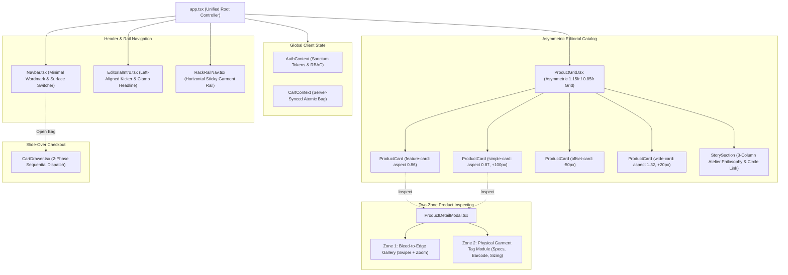

# Frontend Design System Architecture: "The Rail & The Rack"

Status: VERIFIED
Last Updated: 2026-09-23
Author: Arvin & Senior Visual Design Team
Tags: #architecture #frontend #ui-ux #design-system #the-rail-and-the-rack #react

---

## 1. Architectural Philosophy & Context

Generic e-commerce interfaces commonly rely on database-driven uniform card grids, full-width hero banners, middle-dot metadata, and decorative animations. For a multi-vendor apparel marketplace catering to 16+ demographics and independent ateliers, generic templates trigger the perception of low-quality dropshipping and undermine buyer trust.

**"The Rail & The Rack"** architecture replaces generic e-commerce layouts with a physical boutique browsing paradigm:
- **The Rail:** Categories are navigated as a horizontal, scrollable garment rail with thin 1px dividers like clothing hangers.
- **The Rack:** Products are laid out with deliberate asymmetric visual weight, creating a magazine/editorial cadence that triggers the **"Curation Halo Effect"** (users extend higher trust and perceived value to intentionally curated spaces).
- **The Garment Tag:** Technical specs, material composition, and care instructions are presented as a compact physical clothing hangtag rather than generic bulleted text.

---

## 2. Component Topology & Presentation Layer



---

## 3. Design System Tokens & Color Discipline

All color tokens are implemented as CSS custom properties and registered in the Tailwind CSS v4 `@theme` block in `resources/css/app.css`:

```css
:root {
    --bg: #FAFAF8;            /* Warm off-white base surface (~90% surface area) */
    --surface: #FFFFFF;       /* Pure white card backgrounds */
    --ink: #1A1A1A;           /* Primary typographic ink */
    --muted: #6B6B6B;         /* Secondary typographic and metadata ink */
    --border: #E8E6E1;        /* Crisp 1px hairline dividers */
    --accent: #FF5A36;        /* Coral-orange action accent (Strictly buy signals) */
    --accent-hover: #E64A28;  /* Coral hover state */
    --accent-active: #CC3F20; /* Coral active / pressed state */
    --highlight: #FFC94D;     /* Warm yellow attention badge (Curated/Limited) */
    --success: #2E7D5B;       /* Semantic success (Inventory in-stock, dispatches) */
    --error: #D14343;         /* Semantic error (Form/auth/checkout validation) */
    --serif: 'Space Grotesk', sans-serif; /* Display / Headlines */
    --sans: 'DM Sans', sans-serif;        /* Body / Metadata / Specs */
}
```

### Color Usage Constraints
- **Coral Accent (`#FF5A36`):** Reserved exclusively for active user actions ("Add to Bag", active category hanger indicator, bag count badge). Never decorative.
- **Highlight Yellow (`#FFC94D`):** Reserved exclusively for attention and scarcity indicators (`Curated`, `Archive`). Never used for interactive buttons.
- **Hairline Borders (`#E8E6E1`):** Applied with deliberate restraint to divide asymmetric zones without heavy card drop shadows.

---

## 4. Typography Scale & Hierarchy

- **Display Headlines (`Space Grotesk`):**
  - Section titles: `clamp(44px, 5.2vw, 74px)`, line-height `0.88`, letter-spacing `-.1em`.
  - Hero headline: `clamp(52px, 6.5vw, 98px)`, line-height `0.92`, letter-spacing `-.09em`.
  - Italic emphasis: Uses coral accent color `em { font-style: normal; color: var(--accent); }`.
- **Body & Metadata (`DM Sans`):**
  - Base body text: 13–15px, line-height `1.65`, line length capped under 80 characters.
  - Kicker metadata: 10px uppercase, letter-spacing `.13em`, bold weight.
  - Catalog index markers: 10px monospace (`N° 01`, `N° 02`), letter-spacing `.08em`.

---

## 5. Asymmetric Grid Cadence & Ratios

The product grid rejects uniform CSS grid tiles in favor of a 2-column asymmetric arrangement (`1.15fr .85fr`) cycling through 4 distinct cadence tiles:

| Cadence Step | Card Class | Aspect Ratio | Offset / Layout Behavior |
|---|---|---|---|
| **0** | `.feature-card` | `0.86` | Primary prominence in Column 1 |
| **1** | `.simple-card` | `0.87` | Column 2 with `margin-top: 100px` |
| **2** | `.offset-card` | Varied | Column 1 with negative `margin-top: -50px` |
| **3** | `.wide-card` | `1.32` | Column 2 with `margin-top: 20px` (Horizontal silhouette) |

On mobile viewports (`@media (max-width: 760px)`), the layout stacks cleanly to single-column with uniform vertical margins (`48px`) while maintaining high-impact product imagery.

---

## 6. Two-Zone Product Detail Architecture

The product detail modal divides the viewport into two balanced zones:
1. **Zone 1: Bleed-to-Edge Photo Gallery (Left, 7 columns):**
   - High-fidelity product photography powered by Swiper.js.
   - Built-in double-tap and pinch-to-inspect zoom module.
   - Hairline thumbnail navigation row below main viewport.
2. **Zone 2: Physical Garment Tag Module (Right, 5 columns):**
   - **Hangtag Aesthetics:** Punched circular eyelet graphic at top, monospace SKU, atelier attribution.
   - **Structured Specs:** 2-column grid displaying Material (fiber composition), Silhouette (fit cut), Origin (verified maker), and Care instructions.
   - **Barcode Graphic:** Repeating linear gradient barcode representing atelier archive serial.
   - **Variant Selector:** Minimalist size and colorway chips with real-time scarcity alerts.

---

## 7. Motion Restraint & Interaction Architecture

All motion definitions live in `resources/js/lib/motion.ts`. Motion is restrained to **exactly two deliberate signature moments**:
1. **Rack-Rail Horizontal Glide (`rackHangerVariants`):** Smooth horizontal scroll momentum and subtle hover elevation (`y: -2px`) mimicking physical hangers on a boutique rail.
2. **Pull-to-Inspect Zoom (`pullToInspectVariants`):** Smooth scale expansion (`scale: 1.06`) triggered by direct user interaction.

### Functional Micro-Interactions
- **Add-to-Bag Confirmation (`quickAddFeedbackVariants`):** 150–220ms scale pulse (`scale: [1, 1.04, 1]`) providing instant visual satisfaction.
- **Cart Slide-Over (`cartDrawerVariants`):** Crisp slide transition (280–320ms) using custom cubic-bezier timing (`[0.16, 1, 0.3, 1]`).
- **Reduced Motion:** Automatic fallback to static transitions when `prefers-reduced-motion: reduce` is detected.

---

## 8. Anti-Goals Architectural Guardrails

The frontend strictly enforces the avoidance of the 8 common AI-generated template clichés:
1. **No uniform card grids with drop shadows:** Enforced via asymmetric cadence classes.
2. **No full-width hero banners & carousels:** Enforced via left-aligned `.intro-section`.
3. **No ALL-CAPS eyebrow labels:** Enforced via proportional 10px editorial kickers.
4. **No numbered step markers for non-sequences:** Numbering is restricted to physical rail positions (`.hanger-number`) or actual checkout progression.
5. **No middle-dot joined metadata (`Men · Shirts · New`):** Completely eradicated from all templates.
6. **No arrow glyphs (`→`):** Replaced with underlined text links (`.text-link`) or circular badges (`.circle-link`).
7. **No scattered load animations:** Eliminated arbitrary fade-and-slide entrances on page load.
8. **No AI color clichés:** Enforced via strict adherence to the coral, warm yellow, and warm off-white palette.

---

## 9. Related Links
- [[CORE_MEMORY]]
- [[System_Architecture]]
- [[ADR-008_The_Rail_and_The_Rack_Storefront_Design_System]]
- [[ADR-007_Framer_Motion_and_Swiper_for_Frontend_Experience]]
- [[Developer_and_System_Preferences]]
- [[CURRENT_STATE]]
