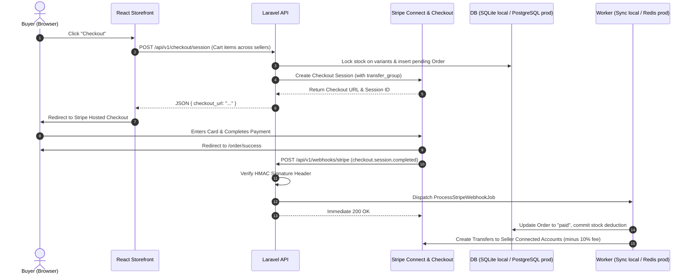

# Payment Pipeline

Status: VERIFIED (Business Logic & Transfer Math) · Docker/Production Target (Postgres & Redis Worker)
Last Updated: 2026-09-23
Tags: #architecture #stripe #payments #marketplace #calibrated

## 1. Multi-Seller Flow Overview (Stripe Connect)

## 2. Key Safeguards & Marketplace Considerations
- **Zero Cardholder Data:** Server never touches raw card data; handled entirely by Stripe Hosted Checkout.
- **Embedded Payment Identifiers:** Payment identifiers (`stripe_session_id`, `stripe_payment_intent_id`) are stored directly on the `orders` table; no separate `payments` table is required.
- **HMAC Signature Check:** Webhook signature verified with `stripe-signature` header and secret.
- **Idempotency Deduplication:** Webhook event IDs logged in `webhook_events` table before processing.
- **Transfer Groups for Multi-Seller Baskets:** A single customer checkout can contain items from multiple sellers. Using `transfer_group` allows the platform to accept one payment from the buyer and dispatch separate transfers to each seller's connected account (`order_items.seller_id`).
- **Platform Application Fee:** Platform retains its agreed commission percentage (10%) on each transaction before vendor payout disbursement (90%).
- **Runtime Execution:** In local development, `ProcessStripeWebhookJob` executes synchronously via `QUEUE_CONNECTION=sync`. In Docker/production, it is handled asynchronously by the Redis queue worker.

## 3. Related Links
- [[CORE_MEMORY]]
- [[Apparel_Marketplace_Requirements_and_Design_Plan]]
- [[Stripe_Payment_Integration_and_Webhooks]]
- [[System_Architecture]]
- [[ADR-006_Stripe_Connect_for_Multi_Seller_Payouts]]
