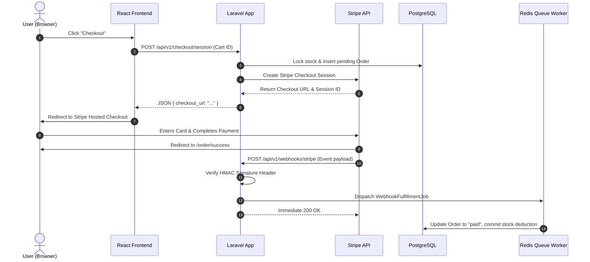

# Payment Pipeline

Status: VERIFIED
Last Updated: 2026-09-23
Tags: #architecture #stripe #payments

## 1. Flow Overview

## 2. Key Safeguards
- **Zero Cardholder Data:** Server never touches raw card data; handled entirely by Stripe.
- **HMAC Signature Check:** Protects webhook endpoint from forged requests.
- **Idempotency Keys:** Payment session creation and webhook handlers log unique event IDs to prevent duplicate processing on network retries.

## 3. Related Links
- [[CORE_MEMORY]]
- [[Stripe_Payment_Integration_and_Webhooks]]
- [[System_Architecture]]
