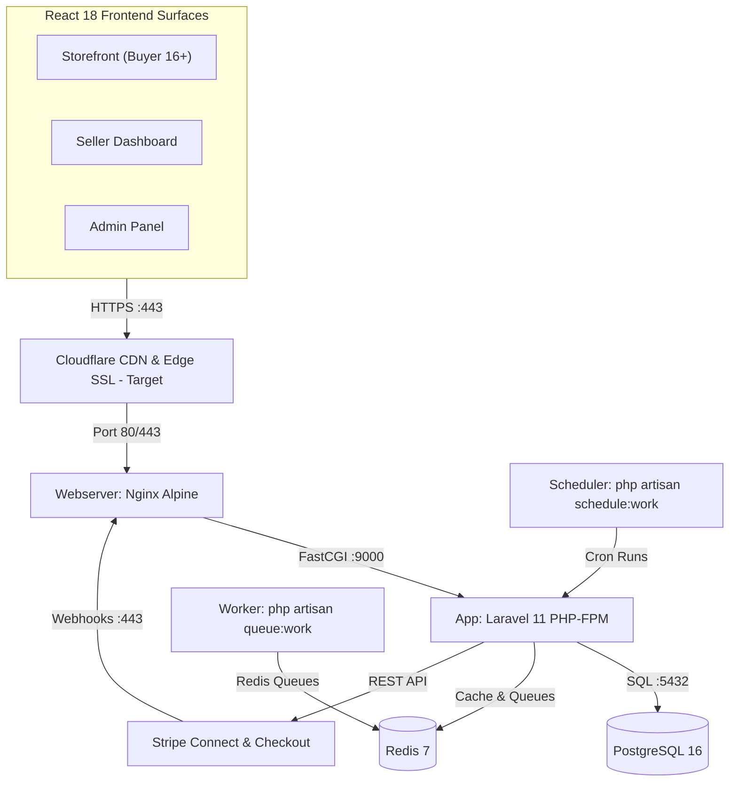

# System Architecture

Status: VERIFIED (Local App Logic & Docker Specs) · PROPOSED (Cloudflare & Production Cloud Deployment)
Last Updated: 2026-09-23
Tags: #architecture #system-design #marketplace #calibrated

## 1. High-Level Topology (Production Blueprint)

## 2. Runtime Environments: Local vs. Production Target
- **Active Local Development Environment (Verified in Workspace):**
  - Web Server & API: Built-in PHP development server (`php artisan serve --port=8000`)
  - Frontend Assets: Vite development server (`npm run dev`)
  - Database: Native file SQLite (`database/database.sqlite`)
  - Queue Broker: Synchronous inline execution (`QUEUE_CONNECTION=sync`)
  - Cache & Session: Local file storage (`SESSION_DRIVER=file`, `CACHE_STORE=file`)
  - Mailer: Log driver (`MAIL_MAILER=log`, writes to `storage/logs/laravel.log`)
- **Docker Compose & Production Target Specification (Verified in Configs, Not Deployed to Cloud):**
  - Reverse Proxy: Nginx Alpine with gzip compression and SSL termination
  - Edge: Cloudflare CDN & DDoS protection (Proposed / Target)
  - Application: PHP 8.4-FPM Alpine multi-stage container
  - Database: PostgreSQL 16 Alpine container with persistent volume
  - In-Memory & Queues: Redis 7 Alpine container for catalog cache, session locks, and async worker queue
  - Hosting: Oracle Cloud Infrastructure (OCI) Ampere A1 instance (Architectural Blueprint / Proposal)

## 3. Layer Responsibilities
- **Edge Layer (Cloudflare):** Terminating SSL, caching static assets, rate limiting, and DDoS filtering (Target).
- **Web Proxy Layer (Nginx):** Reverse proxy, serving gzip-compressed assets, routing API traffic to PHP-FPM, static file caching.
- **Client Presentation Layer (React 18):** Three unified route surfaces (Storefront, Seller Dashboard, Admin Panel) implementing "The Rail & The Rack" bespoke design system ([[Frontend_Design_System_Architecture]]) powered by Framer Motion and Swiper.js ([[ADR-007_Framer_Motion_and_Swiper_for_Frontend_Experience]], [[ADR-008_The_Rail_and_The_Rack_Storefront_Design_System]]).
- **Application Layer (Laravel 11):** Stateless JSON REST API handling RBAC auth (buyer/seller/admin), catalog and variants, cart, order orchestration, and Stripe Connect.
- **Worker Layer (PHP-FPM CLI):** Background queue consumer executing webhook verification, payout splits, and notification dispatches (sync locally, Redis in production).
- **Persistent Data Layer:** ACID transactional storage managing users, seller profiles, product variants, orders, and coupons (SQLite locally, PostgreSQL 16 in production).
- **In-Memory Layer:** Key-value caching for catalogs, user cart states, and asynchronous queue broker (file/array locally, Redis 7 in production).

## 3. Related Links
- [[CORE_MEMORY]]
- [[Apparel_Marketplace_Requirements_and_Design_Plan]]
- [[Frontend_Design_System_Architecture]]
- [[Docker_Containerization]]
- [[Payment_Pipeline]]
- [[Data_Flow_and_Storage]]
- [[ADR-006_Stripe_Connect_for_Multi_Seller_Payouts]]
- [[ADR-007_Framer_Motion_and_Swiper_for_Frontend_Experience]]
- [[ADR-008_The_Rail_and_The_Rack_Storefront_Design_System]]
