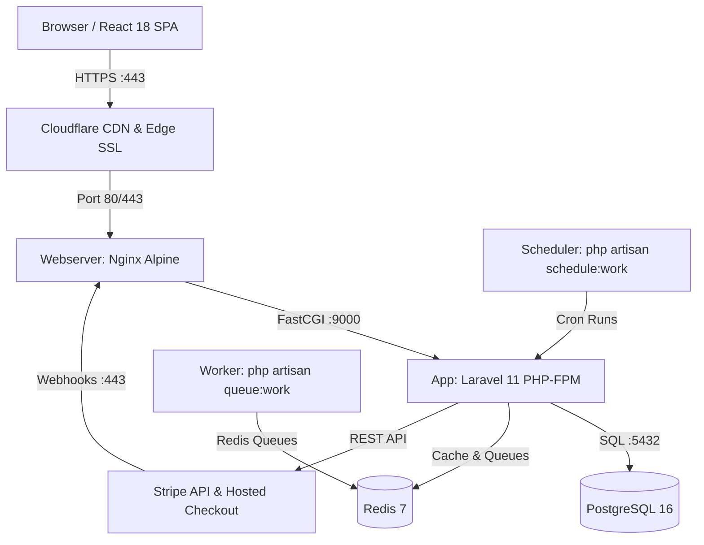

# System Architecture

Status: VERIFIED
Last Updated: 2026-09-23
Tags: #architecture #system-design

## 1. High-Level Topology

## 2. Layer Responsibilities
- **Edge Layer (Cloudflare):** Terminating SSL, caching static assets, rate limiting, and DDoS filtering.
- **Web Proxy Layer (Nginx):** Direct reverse proxy, serving gzip-compressed assets, routing API traffic to PHP-FPM.
- **Application Layer (Laravel 11):** Stateless REST API handling auth, inventory logic, order calculation, and Stripe integration.
- **Worker Layer (PHP-FPM CLI):** Continuous background queue consumer for webhooks, emails, and sync tasks.
- **Persistent Data Layer (PostgreSQL 16):** ACID transactional storage with named volume persistence.
- **In-Memory Layer (Redis 7):** Key-value cache, session store, and queue message broker.

## 3. Related Links
- [[CORE_MEMORY]]
- [[Docker_Containerization]]
- [[Payment_Pipeline]]
- [[Data_Flow_and_Storage]]
