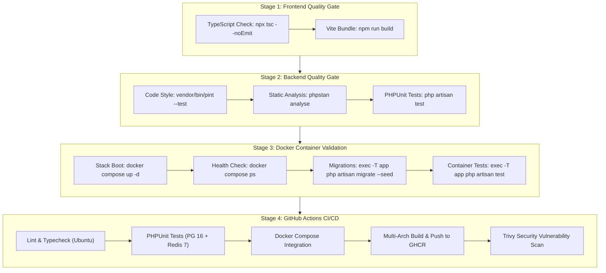

# End-to-End Testing, Build, Docker, and CI/CD Pipeline Flow

Status: VERIFIED
Last Updated: 2026-09-27
Tags: #testing #frontend #backend #docker #ci-cd #github-actions #playbook #quality-gate #runbook

> [!NOTE]
> This operational runbook teaches you the exact commands (**prompts**) to type into your terminal from zero to production. It explains why each command is needed, what happens under the hood, what successful output looks like, and how to fix errors. Following this sequence guarantees zero regressions and 100% green builds in GitHub Actions.

---

## 1. Unified Verification Architecture

Every code change must pass four sequential quality gates before deployment:



---

## 2. Master Command Cheat Sheet (Quick Reference)

| # | Step / Goal | Command to Type | Frequency |
|---|---|---|---|
| **0.1** | Setup Environment | `cp .env.docker .env` | First time on new device |
| **0.2** | Install PHP Packages | `composer install` | When pulling new backend code |
| **0.3** | Install JS Packages | `npm install` | When pulling new frontend code |
| **1.1** | Frontend Type Check | `npx tsc --noEmit` | After modifying `.tsx` / `.ts` files |
| **1.2** | Frontend Asset Build | `npm run build` | Before testing or committing |
| **2.1** | Check Code Style | `vendor/bin/pint --test` | Before committing |
| **2.2** | Auto-Fix Code Style | `vendor/bin/pint` | When Pint reports styling errors |
| **2.3** | Static Code Analysis | `vendor/bin/phpstan analyse --memory-limit=1G` | After writing backend logic |
| **2.4** | Run Automated Tests | `vendor/bin/phpunit` | Before committing |
| **3.1** | Boot Docker Stack | `docker compose up -d` | When testing full stack locally |
| **3.2** | Check Container Health | `docker compose ps` | After booting Docker |
| **3.3** | Check App Config | `docker compose exec -T app php artisan about` | To verify DB & Redis connection |
| **3.4** | Run DB Migrations | `docker compose exec -T app php artisan migrate --seed` | When database schema changes |
| **3.5** | Run Tests in Docker | `docker compose exec -T app vendor/bin/phpunit` | To verify container parity |
| **3.6** | Stop Docker Containers | `docker compose down` | When finished working |
| **4.1** | Push to GitHub | `git add . && git commit -m "feat: ..." && git push origin main` | To deploy & trigger CI/CD |

---

## 3. Step-by-Step Tutorial: All Prompts Explained

### Phase 0: Setup on Any New Device

When you or a teammate clone this project onto Windows, macOS, or Linux, run these commands once:

#### Prompt 0.1: Copy Docker Environment Config
```bash
cp .env.docker .env
```
* **Why**: Docker containers communicate using service names (`DB_HOST=db`, `REDIS_HOST=redis`) rather than `localhost`.
* **Success**: A `.env` file is created with all container credentials and application keys.

#### Prompt 0.2: Install Composer Dependencies
```bash
composer install
```
* **Why**: Downloads Laravel framework, Sanctum, Stripe SDK, Resend, and developer tools into `vendor/`.

#### Prompt 0.3: Install Frontend Dependencies
```bash
npm install
```
* **Why**: Downloads React 18, Tailwind CSS v4, Framer Motion, and Lucide icons into `node_modules/`.

---

### Phase 1: Frontend Testing & Build Gate

Run these commands whenever you edit files in `resources/js/` or `resources/css/`.

#### Prompt 1.1: TypeScript Static Typecheck
```bash
npx tsc --noEmit
```
* **What it does**: Inspects every `.ts` and `.tsx` file against TypeScript compiler rules without generating JavaScript files (`--noEmit`).
* **Expected Output**:
  ```text
  (Silence - no output and returns exit code 0)
  ```
* **Common Error**:
  ```text
  Property 'variant' does not exist on type 'Product'.
  ```
* **How to Fix**: Check the interface in `resources/js/types/` or use optional chaining (`product?.variant`).

#### Prompt 1.2: Compile Production Assets with Vite
```bash
npm run build
```
* **What it does**: Minifies, bundles, tree-shakes, and hashes all React components and CSS into `public/build/assets/`.
* **Expected Output**:
  ```text
  ✓ 2338 modules transformed.
  public/build/manifest.json           1.53 kB
  public/build/assets/app-*.js       480.57 kB
  ✓ built in 7.01s
  ```
* **Common Error**: `Unable to resolve import "./NonExistent"` or CSS syntax error.
* **How to Fix**: Verify the file path and import name in your React components.

---

### Phase 2: Backend Quality & Testing Gate

Run these commands whenever you write or modify controllers, models, migrations, or services.

#### Prompt 2.1: Code Style Verification (Pint)
```bash
# Check if any PHP file violates standards:
vendor/bin/pint --test
```
* **Expected Output**:
  ```text
  {"tool":"pint","result":"passed"}
  ```
* **If it fails**: Automatically format your code with:
  ```bash
  vendor/bin/pint
  ```

#### Prompt 2.2: Deep Static Analysis (Larastan / PHPStan)
```bash
vendor/bin/phpstan analyse --memory-limit=1G
```
* **What it does**: Scans your PHP codebase for hidden bugs, unhandled null values, incorrect method return types, and invalid Eloquent queries.
* **Expected Output**:
  ```text
  [OK] No errors
  ```
* **Common Error**: `Method App\Services\CartService::checkout() should return Order but returns null.`
* **How to Fix**: Add proper return type hints or handle the null fallback.

#### Prompt 2.3: Run Automated Test Suite (PHPUnit)
```bash
# Run the complete test suite:
php artisan test --compact

# OR run a specific test file:
vendor/bin/phpunit tests/Feature/AuthTest.php
```
* **What it does**: Tests API endpoints (authentication, catalog browsing, cart operations, Stripe checkout, webhook handling) in memory with zero database side effects.
* **Expected Output**:
  ```text
  OK (77 tests, 304 assertions)
  ```
* **If it fails**: Read the failure trace showing which HTTP status code or database assertion did not match.

---

### Phase 3: Docker Local Container Validation

Run these commands to ensure your code runs identically inside the production Linux container environment.

> [!IMPORTANT]
> When executing commands inside Docker on Windows or non-interactive shells, **always include `-T`** (e.g. `docker compose exec -T app ...`). This disables pseudo-TTY allocation and prevents command freezes.

#### Prompt 3.1: Start All Containers in Background
```bash
docker compose up -d
```
* **What it does**: Starts 6 containers: `app` (PHP 8.4), `webserver` (Nginx), `db` (Postgres 16), `redis` (Redis 7), `worker` (Queues), and `scheduler` (Cron).
* **Expected Output**:
  ```text
  Container ecommerce-db Started
  Container ecommerce-redis Started
  Container ecommerce-app Started
  Container ecommerce-webserver Started
  ```

#### Prompt 3.2: Verify Container Health
```bash
docker compose ps
```
* **Expected Output**: All containers must show `Up` and `healthy`:
  ```text
  NAME                  STATUS                    PORTS
  ecommerce-app         Up                        9000/tcp
  ecommerce-db          Up (healthy)              0.0.0.0:5432->5432/tcp
  ecommerce-redis       Up (healthy)              0.0.0.0:6379->6379/tcp
  ecommerce-webserver   Up                        0.0.0.0:8000->80/tcp
  ecommerce-worker      Up                        9000/tcp
  ecommerce-scheduler   Up                        9000/tcp
  ```

#### Prompt 3.3: Verify App Connectivity Inside Container
```bash
docker compose exec -T app php artisan about
```
* **What it does**: Confirms that PHP in Docker successfully connects to PostgreSQL (`pgsql`) and Redis (`redis`).

#### Prompt 3.4: Run Database Migrations & Seeds in PostgreSQL
```bash
docker compose exec -T app php artisan migrate --seed --force
```
* **What it does**: Executes SQL migrations and populates sample categories, products, and variants inside PostgreSQL.
* **Expected Output**:
  ```text
  INFO Seeding database.
  Database\Seeders\CategorySeeder .... DONE
  Database\Seeders\ProductSeeder ..... DONE
  ```

#### Prompt 3.5: Run Tests Inside the Container
```bash
docker compose exec -T app vendor/bin/phpunit
```
* **What it does**: Proves that the code behaves identically inside Alpine Linux and PHP 8.4-FPM.

#### Prompt 3.6: Stopping Containers Cleanly
```bash
# Pause containers (fast resume later):
docker compose stop

# Stop and remove containers (preserves database data volumes):
docker compose down

# To completely wipe and reset database:
docker compose down -v
```

---

### Phase 4: Git Commit & GitHub Actions CI/CD Pipeline

Once all local checks pass, push to GitHub. GitHub Actions will execute the exact same checks in the cloud.

#### Prompt 4.1: Stage, Commit, and Push
```bash
git add .
git commit -m "feat: add product variant inventory validation"
git push origin main
```

#### Prompt 4.2: Watch CI/CD Pipeline Status
You can view the real-time pipeline run in your browser at:
`https://github.com/<your-username>/ecommerce-backend/actions`

Or using the GitHub CLI:
```bash
gh run list
gh run watch
```

#### What GitHub Actions Executes Automatically:
1. **`lint`**: Clones repo, runs `vendor/bin/pint --test`, `phpstan analyse`, and `npx tsc --noEmit`.
2. **`test`**: Spins up PostgreSQL 16 & Redis 7 services, builds Vite assets, and runs PHPUnit.
3. **`integration`**: Runs `docker compose up -d --build`, waits for health, and migrates database.
4. **`build-and-push`**: Compiles production multi-platform image (`linux/amd64` and `linux/arm64`) and publishes to GitHub Container Registry (`ghcr.io`).
5. **`scan`**: Runs Trivy security scan for vulnerabilities.

---

## 4. One-Command Local Validation Shortcut

To verify everything locally in 10 seconds before committing, run:

```bash
composer verify
```

*(Configured in `composer.json` to execute `tsc`, `npm run build`, `pint --test`, `phpstan`, and `phpunit` in a single pass).*

If `composer verify` outputs all green, your code is guaranteed to pass GitHub Actions CI/CD.

---

## 5. Related Links
- [[CORE_MEMORY]]
- [[Docker_Local_Development_and_Testing_Workflow]]
- [[GitHub_Actions_CI_CD_Automation_and_Zero_Config_Fallback]]
- [[ADR-004_Multi_Stage_Docker_Builds_for_Production]]
- [[CI_CD_NPM_Lockfile_Sync_and_Static_Analysis_Fixes]]
