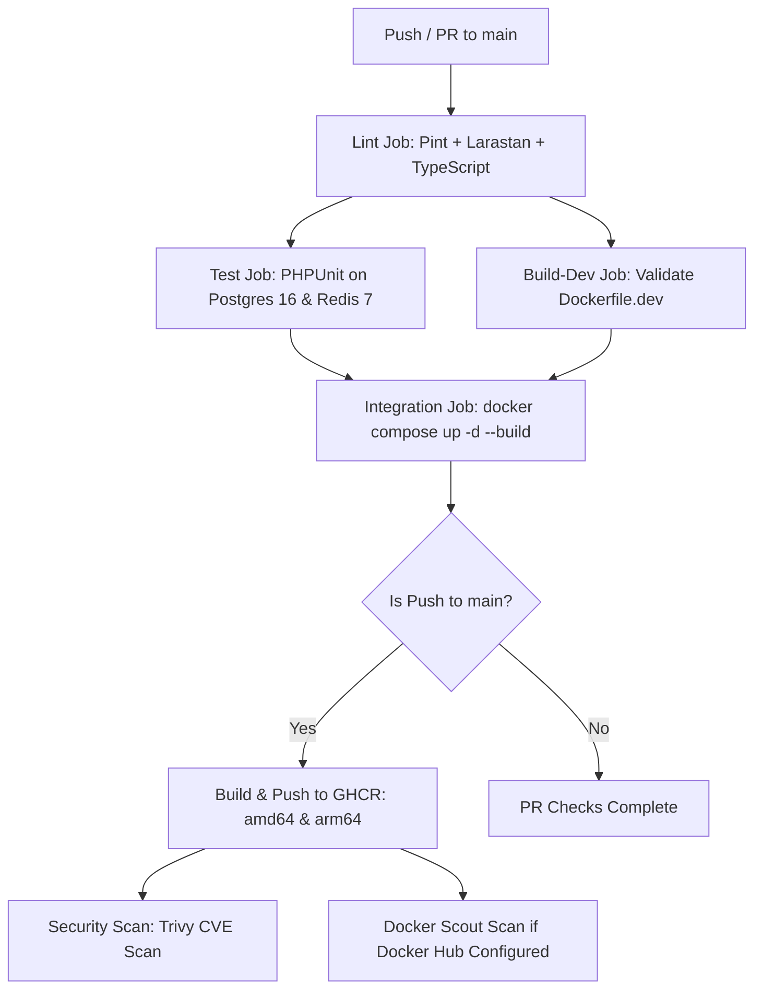

# GitHub Actions CI/CD Automation & Zero-Config Fallback Pipeline

Status: VERIFIED
Last Updated: 2026-09-25
Tags: #ci-cd #github-actions #docker #ghcr #trivy #docker-build-cloud #devops

## 1. High-Level Architecture

The GitHub Actions workflow (`.github/workflows/ci.yml`) is architected with a **dual-tier execution model**:
1. **Tier 1 (Automatic / Zero-Config)**: Executes seamlessly on every push/PR without requiring any repository secrets. Uses GitHub-hosted runners, native services, QEMU for ARM64/AMD64 multi-architecture builds, GitHub Container Registry (`ghcr.io`), and Trivy security scanning.
2. **Tier 2 (Turbo Boost / Docker Build Cloud)**: If optional Docker Hub credentials (`DOCKER_ACCOUNT`, `CLOUD_BUILDER_NAME`, `DOCKER_ACCESS_TOKEN`) are supplied, the pipeline transparently accelerates multi-platform builds using remote cloud builders and enables Docker Scout vulnerability analysis.



---

## 2. Pipeline Stages

| Job | Trigger | Runtime / Tools | Verification Objective |
|---|---|---|---|
| **`lint`** | All pushes & PRs | PHP 8.4, Node 20, Pint, Larastan, TypeScript | Code formatting, static type safety, zero lint regressions |
| **`test`** | Needs `lint` | PostgreSQL 16 Alpine, Redis 7 Alpine containers | 77+ PHPUnit API feature tests against real services |
| **`build-dev`** | Needs `lint` | Docker Buildx / Cloud | Validates development `docker/php/Dockerfile` builds cleanly |
| **`integration`** | Needs `test` | `docker compose up -d --build` | Full multi-container stack boots, migrates, and seeds |
| **`build-and-push`** | Main push only | QEMU + Buildx / Docker Build Cloud -> GHCR | Multi-platform (`linux/amd64`, `linux/arm64`) production image |
| **`scan`** | Main push only | Trivy + Docker Scout (conditional) | Automated CVE vulnerability reporting (non-blocking) |

---

## 3. Zero-Configuration Automation Mechanics

### A. QEMU Multi-Platform Emulation
- When `DOCKER_ACCOUNT` is empty, the runner automatically provisions QEMU:
  ```yaml
  - name: Set up QEMU (multi-platform fallback)
    if: env.DOCKER_ACCOUNT == ''
    uses: docker/setup-qemu-action@v3
  ```
- This allows standard GitHub Actions x86_64 runners to build both `linux/amd64` and `linux/arm64` container images without needing specialized hardware or external cloud builder subscriptions.

### B. Built-In Authentication (GHCR)
- Images are pushed to GitHub Container Registry using the automatic, scoped `GITHUB_TOKEN`:
  ```yaml
  - name: Log in to GitHub Container Registry (GHCR)
    uses: docker/login-action@v3
    with:
      registry: ghcr.io
      username: ${{ github.actor }}
      password: ${{ secrets.GITHUB_TOKEN }}
  ```
- Zero manual registry tokens or Docker Hub logins are required.

### C. Docker Compose In-Tree Integration
- The integration test verifies the full stack by compiling the local source:
  ```yaml
  - name: Start Docker Compose stack
    run: docker compose up -d --build

  - name: Wait for services to be healthy
    run: |
      docker compose ps
      timeout 60 bash -c 'until docker compose exec -T app php artisan about >/dev/null 2>&1; do sleep 2; done'

  - name: Run database migrations
    run: docker compose exec -T app php artisan migrate --seed --force

  - name: Run integration tests
    run: docker compose exec -T app php artisan test --compact
  ```

### D. Zero-Credential Vulnerability Scanning (Trivy)
- Aquasecurity Trivy scans the newly built GHCR image directly without external accounts:
  ```yaml
  - name: Run Trivy vulnerability scan
    uses: aquasecurity/trivy-action@master
    with:
      image-ref: 'ghcr.io/${{ github.repository }}:sha-${{ github.sha }}'
      format: 'table'
      exit-code: '0'
      ignore-unfixed: true
      severity: 'CRITICAL,HIGH'
  ```

---

## 4. Optional Turbo Boost: Docker Build Cloud Configuration

If accelerated cloud builds and Docker Scout are desired:
1. Navigate to repository **Settings > Secrets and variables > Actions**.
2. Define the optional secrets:
   - `DOCKER_ACCOUNT`: Docker Hub username or organization.
   - `CLOUD_BUILDER_NAME`: Cloud builder name from [app.docker.com/build](https://app.docker.com/build).
   - `DOCKER_ACCESS_TOKEN`: Personal Access Token from [hub.docker.com/settings/security](https://hub.docker.com/settings/security).
   - `DOCKERHUB_USERNAME`: Docker Hub username.
   - `DOCKERHUB_TOKEN`: Same as `DOCKER_ACCESS_TOKEN`.

---

## 5. Related Links
- [[CORE_MEMORY]]
- [[Docker_Containerization]]
- [[Docker_Local_Development_and_Testing_Workflow]]
- [[GitHub_Push_Protection_and_Environment_Secrets_Leak_Remediation]]
- [[ADR-004_Multi_Stage_Docker_Builds_for_Production]]
