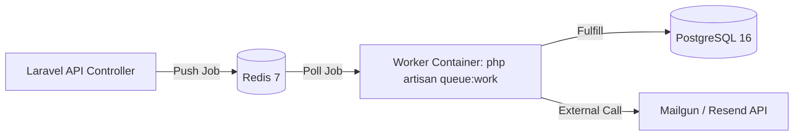

# Redis Queues and Worker Architecture

Status: PROPOSED (Docker / Production Spec) · SYNC (Local Runtime)
Last Updated: 2026-09-23
Tags: #knowledge #redis #queues #architecture #proposed

> [!NOTE]
> **Active Codebase Reality:** In local development, `.env` configures `QUEUE_CONNECTION=sync` and `SESSION_DRIVER=file` for zero-dependency execution. Asynchronous Redis queue workers are defined in `docker-compose.yml` and GitHub Actions CI.

## 1. Asynchronous Queue Architecture
In high-throughput e-commerce, long-running operations must never block HTTP request lifecycles.



## 2. Docker Worker Configuration
The `worker` container runs the same application image as `app`, but executes:
```bash
php artisan queue:work redis --sleep=3 --tries=3 --max-time=3600
```
- `--sleep=3`: Waits 3 seconds when no jobs exist, preserving CPU cycles.
- `--tries=3`: Retries failed jobs up to 3 times before moving them to the `failed_jobs` table.
- `--max-time=3600`: Restarts the worker process hourly to prevent PHP memory leaks.

## 3. Best Practices
- Keep jobs idempotent so retries do not perform duplicate actions (e.g. charging a card twice or double-deducting stock).
- Use job middleware (`Illuminate\Queue\Middleware\WithoutOverlapping`) for operations touching specific user or order IDs.

## Related Links
- [[CORE_MEMORY]]
- [[Docker_Containerization]]
- [[ADR-003_Redis_for_Caching_Sessions_and_Queues]]
